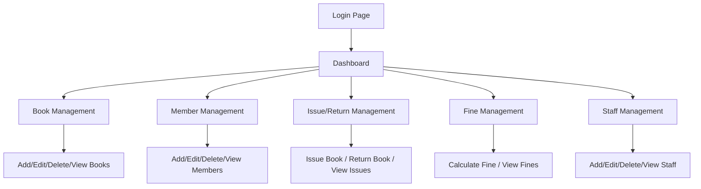

# Library Management System — Implementation Plan

## Overview

Build a **fully functional Library Management System** as a single-page application (SPA) using HTML, CSS, and JavaScript. Since no backend server is available, all data operations will be simulated using **localStorage** as the database layer, with the same schema and logic as defined in the MySQL spec.

## Architecture



## Design System

- **Theme**: Dark mode with glassmorphism, gradient accents (indigo → violet → rose)
- **Typography**: Google Font — **Inter** for UI, **Outfit** for headings
- **Animations**: Smooth page transitions, hover effects, micro-animations on cards and buttons
- **Layout**: Sidebar navigation + main content area, fully responsive

## Data Layer (localStorage)

All 7 database tables will be stored as JSON arrays in localStorage:
- `lms_authors`, `lms_categories`, `lms_books`, `lms_members`, `lms_issues`, `lms_fines`, `lms_staff`
- Auto-incrementing IDs managed in JavaScript
- Foreign key relationships enforced in code
- Seeded with sample data on first load

### Stored Procedures (JS Functions)

1. **`issueBook(bookId, memberId)`** — Creates issue record, sets due date (14 days), updates book availability
2. **`calculateFine(issueId)`** — Calculates ₹5/day fine for overdue returns

### Triggers (JS Logic)

1. **UpdateBookAvailability** — On issue: set `availability = "Issued"`; on return: set `availability = "Available"`
2. **AutoFineCalculation** — On return, if `return_date > due_date`, auto-insert fine record

## Project Structure

```
library-management-system/
├── index.html          # Main SPA entry point
├── css/
│   └── styles.css      # Complete design system + all component styles
├── js/
│   ├── app.js          # Main app controller, routing, initialization
│   ├── db.js           # LocalStorage database layer + seed data
│   ├── dashboard.js    # Dashboard module
│   ├── books.js        # Book management module
│   ├── members.js      # Member management module
│   ├── issues.js       # Issue/Return management module
│   ├── fines.js        # Fine management module
│   └── staff.js        # Staff management module
└── sql/
    └── schema.sql      # MySQL schema for reference (CREATE TABLE, procedures, triggers)
```

## Proposed Changes

### HTML Entry Point

#### [NEW] [index.html](file:///C:/Users/sanvi/.gemini/antigravity/scratch/library-management-system/index.html)
- Login screen with username/password (default: admin/admin)
- Sidebar navigation with icons for all 6 modules
- Main content area that swaps views dynamically
- Modal dialogs for Add/Edit forms

---

### CSS Design System

#### [NEW] [styles.css](file:///C:/Users/sanvi/.gemini/antigravity/scratch/library-management-system/css/styles.css)
- CSS custom properties for colors, spacing, typography
- Dark glassmorphism theme with gradient accents
- Responsive grid layouts, card components, table styles
- Form styles, button variants, modal styles
- Animations and transitions

---

### JavaScript Modules

#### [NEW] [db.js](file:///C:/Users/sanvi/.gemini/antigravity/scratch/library-management-system/js/db.js)
- CRUD operations for all 7 tables
- Auto-increment ID management
- Seed data (10+ books, 5+ members, 3+ staff, sample issues)
- `issueBook()` and `calculateFine()` stored procedure equivalents
- Trigger logic for availability and auto-fine

#### [NEW] [app.js](file:///C:/Users/sanvi/.gemini/antigravity/scratch/library-management-system/js/app.js)
- SPA router — hash-based navigation
- Login/logout flow
- Sidebar active state management
- Global event delegation

#### [NEW] [dashboard.js](file:///C:/Users/sanvi/.gemini/antigravity/scratch/library-management-system/js/dashboard.js)
- Summary cards: Total Books, Total Members, Issued Books, Available Books
- Recent activity feed
- Quick action buttons

#### [NEW] [books.js](file:///C:/Users/sanvi/.gemini/antigravity/scratch/library-management-system/js/books.js)
- Book table with search/filter
- Add/Edit book form (with author & category dropdowns)
- Delete with confirmation
- Author and Category management sub-sections

#### [NEW] [members.js](file:///C:/Users/sanvi/.gemini/antigravity/scratch/library-management-system/js/members.js)
- Member table with search
- Add/Edit/Delete member operations

#### [NEW] [issues.js](file:///C:/Users/sanvi/.gemini/antigravity/scratch/library-management-system/js/issues.js)
- Issue book form (select available book + member)
- Return book action
- View all issued books with status

#### [NEW] [fines.js](file:///C:/Users/sanvi/.gemini/antigravity/scratch/library-management-system/js/fines.js)
- Fine calculation display
- View all fines with paid/unpaid status
- Mark fine as paid

#### [NEW] [staff.js](file:///C:/Users/sanvi/.gemini/antigravity/scratch/library-management-system/js/staff.js)
- Staff table with CRUD operations

---

### SQL Reference

#### [NEW] [schema.sql](file:///C:/Users/sanvi/.gemini/antigravity/scratch/library-management-system/sql/schema.sql)
- Complete MySQL schema with all 7 tables
- Foreign key constraints
- Stored procedures: `IssueBook()`, `CalculateFine()`
- Triggers: `UpdateBookAvailability`, `AutoFineCalculation`

## Verification Plan

### Automated Tests
- Open the app in browser and test all CRUD flows
- Verify login/logout works
- Test issuing and returning books
- Verify fine auto-calculation on overdue returns
- Test responsiveness

### Manual Verification
- Visual inspection of all pages
- Walk through the complete project flow: Login → Dashboard → Book Mgmt → Member Mgmt → Issue → Return → Fine → Staff
